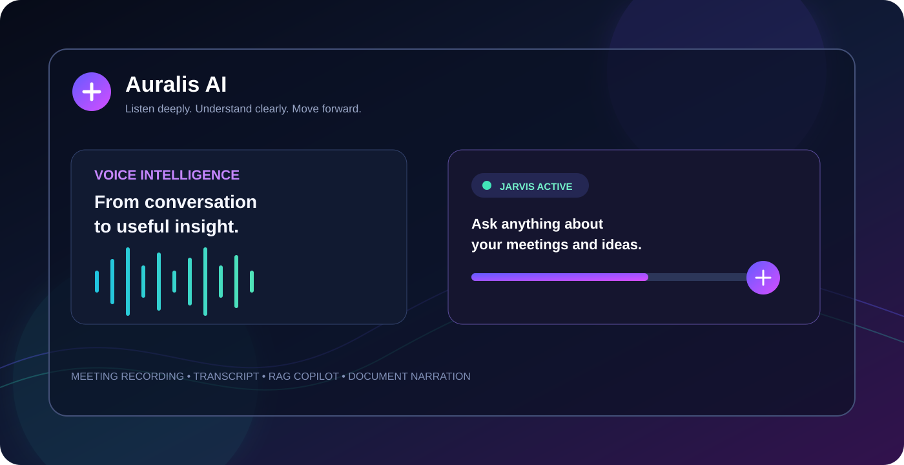
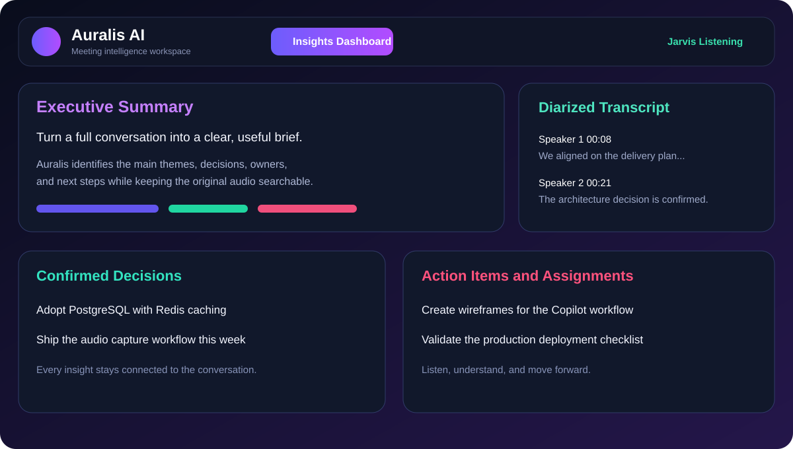
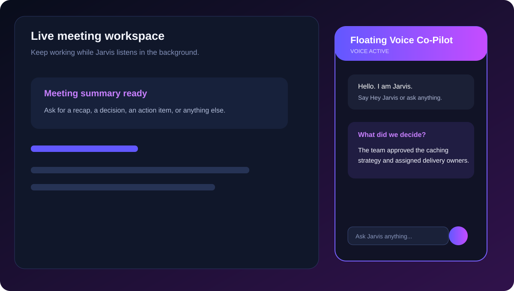
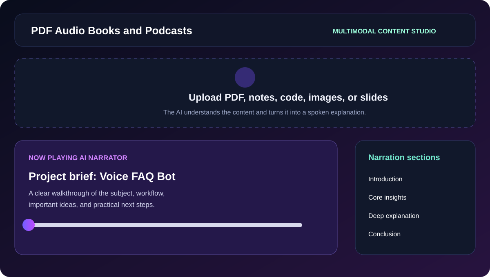
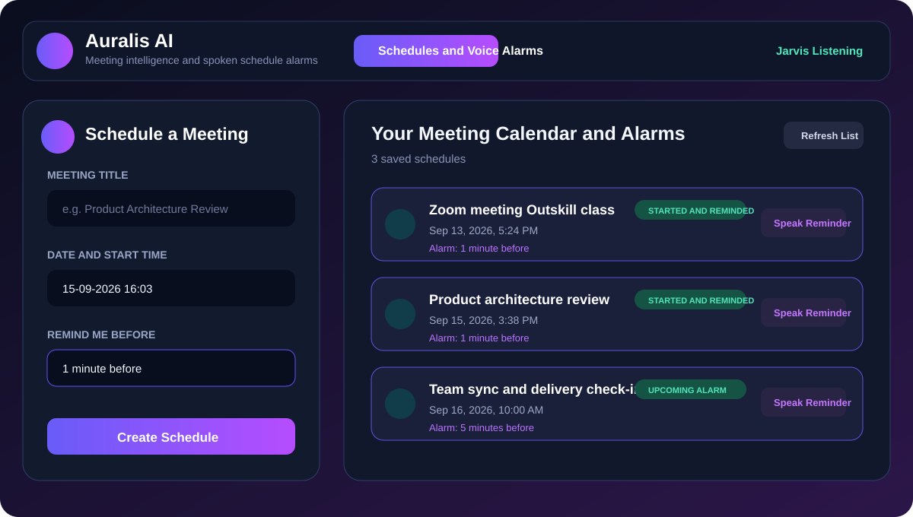
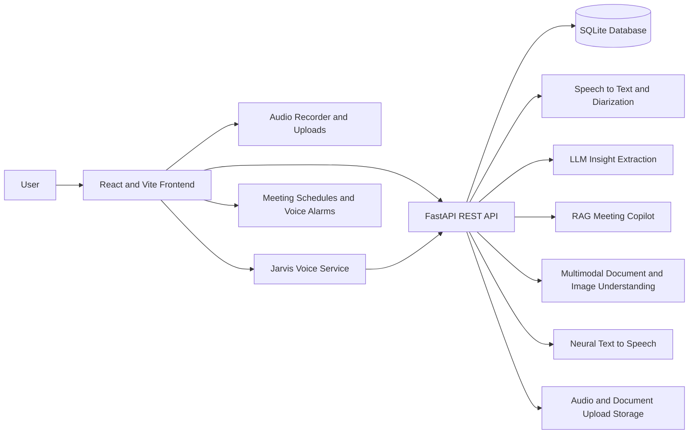

# Auralis AI

[](frontend/package.json)
[](frontend/package.json)
[](backend/main.py)
[](backend/main.py)
[](backend/services/database_service.py)
[](LICENSE)

> A voice-first meeting intelligence workspace for recording conversations, understanding documents, and turning scattered information into useful answers.



## Product Preview

### Insights Dashboard



### Floating Voice Co-Pilot



### Document Narration Studio



### Schedules and Voice Alarms



## Project Overview

Auralis AI helps people capture and understand meetings without manually replaying long recordings or searching through disconnected notes. It combines audio recording, transcription, speaker-aware analysis, AI summaries, document understanding, natural voice responses, and an always-available Copilot in one workspace.

The application is designed for students, teams, founders, researchers, support staff, and anyone who needs to move quickly from spoken information to clear next steps.

## Why Auralis AI Exists

Important information is often trapped in meeting recordings, screenshots, PDFs, presentations, and personal notes. Traditional workflows make users:

- Replay entire recordings to find one answer.
- Manually write summaries and action items.
- Lose track of who said what.
- Switch between separate transcription, note-taking, and text-to-speech tools.
- Struggle to understand visual documents and screenshots.
- Miss meetings or reminders because the information is not available at the right moment.

Auralis AI solves this by creating a single conversational layer over recordings, meetings, schedules, documents, and visual content.

## Core Features

### Meeting recording and transcription

- Record microphone audio, device audio, or both together.
- Upload MP3, WAV, M4A, and WebM recordings.
- Transcribe conversations with speaker diarization.
- Inspect a searchable transcript with timeline navigation.
- Review speaker counts, duration, and conversation structure.

### AI meeting intelligence

- Generate an executive summary from each recording.
- Extract decisions, action items, topic chapters, and speaker insights.
- Ask questions about what was said in a meeting.
- Jump from an insight or transcript section to the related audio.
- Generate a spoken summary for hands-free review.

### Jarvis voice assistant

- Keep the assistant available across application views.
- Activate with phrases such as `Hey Jarvis`, `Hello Jarvis`, `Jarvis`, `Hey`, or `Hello`.
- Ask questions by voice or text.
- Receive spoken answers through neural audio or browser speech fallback.
- Ask general questions as well as recording-specific questions.
- Use push-to-talk when continuous listening is not appropriate.

### Floating Voice Co-Pilot

- Open the assistant as a movable floating panel.
- Use a native Picture-in-Picture window where supported.
- Record and summarize a meeting without leaving the current workflow.
- Ask the Copilot about the active recording or any general topic.
- Mute spoken responses independently from text answers.

### Document and visual understanding

- Upload PDFs, text, Markdown, code, CSV, JSON, YAML, XML, HTML, office files, slides, and images.
- Use multimodal AI to read visible text and understand charts, diagrams, screenshots, and illustrations.
- Convert meaningful content into a detailed spoken explanation.
- Avoid narrating filenames, upload metadata, screenshot dates, or internal processing details.

### PDF audio books and narrated summaries

- Generate solo-narrator audio from books and documents.
- Organize explanations into introduction, core insights, deep analysis, and conclusion sections.
- Play, pause, seek, rewind, fast-forward, and change playback speed.
- Download generated MP3 audio.

### Schedules and voice alarms

- Schedule meetings with notes and reminder timing.
- Receive spoken reminders before a meeting starts.
- Mark meetings as started automatically.
- Manage scheduled items from a dedicated calendar and alarm view.

### Meeting archive

- Browse previous recordings and generated insights.
- Search meeting history.
- Reopen a meeting for transcript, summary, audio, and Copilot questions.

## Product Screens

The frontend includes dedicated views for the main workflows:

| View                         | Purpose                                                               |
| ---------------------------- | --------------------------------------------------------------------- |
| Insights Dashboard           | Review summaries, decisions, actions, speakers, transcript, and audio |
| Schedules and Voice Alarms   | Create reminders and hear spoken meeting alerts                       |
| PDF Audio Books and Podcasts | Turn documents and images into narrated explanations                  |
| Past History                 | Search and reopen earlier meeting records                             |
| Floating Mode and PiP        | Keep Jarvis available while working elsewhere                         |

The product preview assets live in [docs/screenshots](docs/screenshots). They mirror the application's dark violet interface, insight panels, floating Jarvis experience, and document-to-audio workflow.

## Architecture



## Technical Stack

### Frontend

- React 19
- Vite
- JavaScript and JSX
- `lucide-react` for interface icons
- Web Speech API for wake-word recognition and browser fallback speech
- MediaRecorder API for microphone and device audio capture
- Document Picture-in-Picture API where supported

### Backend

- Python
- FastAPI
- Uvicorn
- Pydantic request models
- CORS middleware
- SQLite persistence
- Static media serving for uploads and generated audio

### AI and media services

- Groq or Gemini for language reasoning and insight generation
- Gemini multimodal understanding for images, slides, and visual documents
- Deepgram or AssemblyAI for transcription providers
- Deepgram voice generation with browser speech fallback
- TF-IDF retrieval for meeting transcript context

## API Surface

The backend exposes endpoints for:

- Health and configuration: `/api/health`, `/api/config`
- Authentication: `/api/auth/config`, `/api/auth/google`, `/api/auth/me`
- Audio processing: `/api/process-audio`
- Meetings: `/api/meetings`, `/api/meetings/{meeting_id}`
- Meeting Copilot: `/api/meetings/{meeting_id}/chat`
- Email drafting: `/api/meetings/{meeting_id}/email`
- Spoken summaries: `/api/meetings/{meeting_id}/voice-summary`
- Document narration: `/api/podcasts/process-pdf`, `/api/podcasts`
- Jarvis reasoning: `/api/jarvis/think`
- Schedules and voice reminders: `/api/schedules`

## Local Development

### Prerequisites

- Python 3.10 or newer
- Node.js 18 or newer
- npm
- API credentials for the transcription, language, voice, and Google authentication features you plan to use

### 1. Clone the repository

```bash
git clone https://github.com/Hrushikesh-2006/Auralis-AI.git
cd Auralis-AI
```

### 2. Configure the backend

Copy `.env.example` to `.env` and add your own credentials. Never commit `.env`.

```bash
copy .env.example .env
```

On macOS or Linux, use:

```bash
cp .env.example .env
```

Install the backend dependencies required by your environment, then start FastAPI from the repository root:

```bash
python -m uvicorn backend.main:app --reload --host 127.0.0.1 --port 8000
```

### 3. Start the frontend

```bash
cd frontend
npm install
npm run dev
```

Open `http://127.0.0.1:5173` in a browser. The local frontend defaults to `http://127.0.0.1:8000` for the API.

## Frontend Deployment on Vercel

The frontend is prepared for Vercel deployment:

1. Import the GitHub repository into Vercel.
2. Set the project root directory to `frontend`.
3. Use build command `npm run build`.
4. Use output directory `dist`.
5. Add `VITE_API_URL` with the public URL of the deployed FastAPI backend.
6. Deploy and verify the backend CORS configuration allows the Vercel domain.

The SPA rewrite is configured in [frontend/vercel.json](frontend/vercel.json). The backend must be deployed separately because it handles Python processing, media uploads, AI calls, and persistent application data.

## Environment Variables

The backend reads these values from `.env`:

| Variable                 | Purpose                                                        |
| ------------------------ | -------------------------------------------------------------- |
| `GROQ_API_KEY`           | Fast language reasoning and meeting insights                   |
| `GEMINI_API_KEY`         | Multimodal image and document understanding, language fallback |
| `DEEPGRAM_API_KEY`       | Speech transcription and neural voice generation               |
| `ASSEMBLYAI_API_KEY`     | Optional transcription provider                                |
| `OPENAI_API_KEY`         | Optional language provider                                     |
| `TRANSCRIPTION_PROVIDER` | Selects or prioritizes the transcription provider              |
| `LLM_PROVIDER`           | Selects the language model provider                            |
| `GOOGLE_CLIENT_ID`       | Google sign-in configuration                                   |
| `GOOGLE_CLIENT_SECRET`   | Google sign-in verification configuration                      |
| `AUTH_SECRET`            | Local authentication token signing secret                      |

The frontend reads:

| Variable       | Purpose                                               |
| -------------- | ----------------------------------------------------- |
| `VITE_API_URL` | Public FastAPI base URL used by the deployed frontend |

## Validation

Run the frontend checks from `frontend`:

```bash
npm run build
npm run lint
```

Run the backend document pipeline test from the repository root:

```bash
python -m unittest backend.test_document_pipeline
```

## Security and Data Notes

- Secrets are intentionally excluded through `.gitignore`.
- Use fresh provider keys in deployment environments.
- Rotate any credentials that may have been exposed during local development.
- Browser microphone access requires user permission and a secure origin in production.
- SQLite and local uploads are suitable for development and small deployments; production deployments should use persistent storage and a managed database.
- Configure production CORS to the actual frontend domain instead of allowing every origin.

## Repository Structure

```text
Auralis-AI/
|-- backend/
|   |-- main.py
|   |-- config.py
|   |-- services/
|   |   |-- auth_service.py
|   |   |-- database_service.py
|   |   |-- jarvis_service.py
|   |   |-- llm_service.py
|   |   |-- pdf_podcast_service.py
|   |   |-- rag_service.py
|   |   |-- transcription_service.py
|   |   `-- tts_service.py
|   `-- test_document_pipeline.py
|-- frontend/
|   |-- src/
|   |   |-- components/
|   |   `-- services/
|   |-- public/
|   |-- vercel.json
|   `-- package.json
|-- .env.example
|-- .gitignore
`-- README.md
```

## License

This project is distributed under the MIT License. See [LICENSE](LICENSE) for details.

## Author

Developed by [Hrushikesh Anumula](https://github.com/Hrushikesh-2006).

- Email: [hrushikeshanumula1111@gmail.com](mailto:hrushikeshanumula1111@gmail.com)
- LinkedIn: [linkedin.com/in/hrushikesh-anumula](https://www.linkedin.com/in/hrushikesh-anumula)

If Auralis AI helps your workflow, consider starring the repository and sharing feedback.
